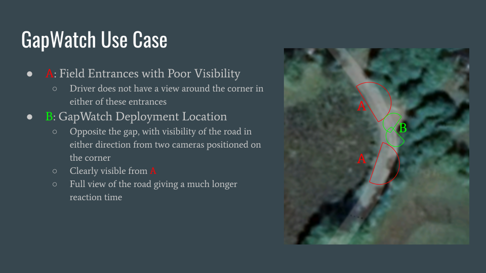
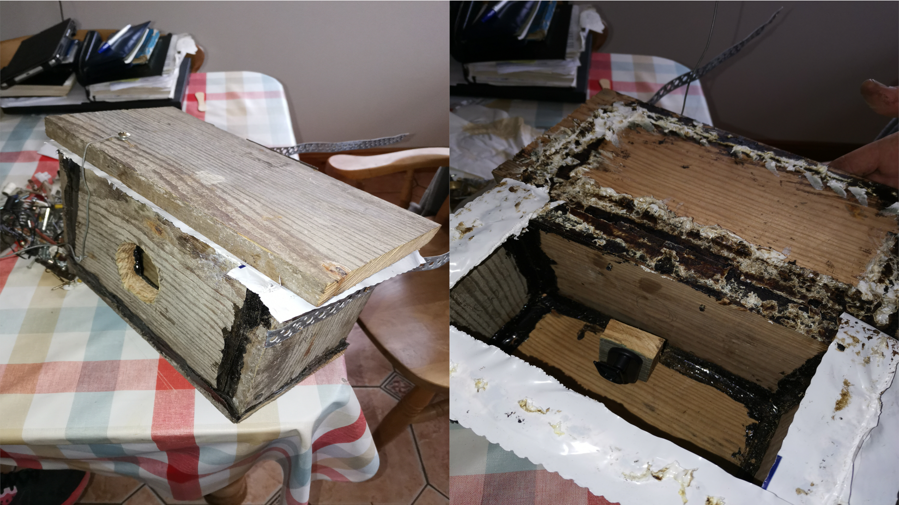

# GapWatch: Making Rural Roads Safer

Unfortunately many road accidents happen in rural areas which could have been avoided if there was more information available to the drivers involved. GapWatch is a project investigating the use of computer vision and audio to increase the amount of information available to drivers exiting dangerous fields with the aim of reducing accidents.

## Use Case Diagram



## Current Progress

As of June 2020, several major milestones have been achieved:

* Obtained 4 weeks of video data from rural roads in Ireland
* Built a labeling tool for labeling clips of video quickly and accurately
* Labeled videos for "Danger" or "No Danger"
* Verified that a simple Logistic Regression model could achieve performance on unseen video clips and locations comparable to the data it was trained on
* Deployed the simple Logistic Regression model in the field on a laptop for live inference, using  an Arduino and LED

## Live Demonstration

The (very early stage) model is demonstrated in the following video (click on it to view on YouTube)

[](https://youtu.be/I62uLfGEN3U)

The full training and validation process for this model is shown in a jupyter notebook [here.](https://github.com/mdunlop2/GapWatch/blob/master/common/model/training/n3060_basic/n3060_basic.ipynb)

## Data Capture



### Design Criteria

* Extremely low cost
   * Made the enclosure from some old floorboards, broken window and some plumbing silicon
* Waterproof
   * Camera enclosure endured outdoor weather for over 4 weeks while keeping the electronics inside dry and safe
* Allow sound to pass inside
   * Critical that sound information could be recorded
* Camera must require minimum maintenance
   * Nanny cam capable of recording a day's data on the 32GB SD card
   * Easy to copy and paste the files over to PC hard drive each day
   * 20,000 mAh battery lasted about 7 days of non-stop recording, recharge battery each week

###  Camera Used:

[Nanny cam](https://www.amazon.co.uk/gp/product/B07PPM2RCC/ref=ppx_yo_dt_b_asin_title_o04_s00?ie=UTF8&psc=1) from Amazon, got on a lightning deal for £25.

### Future Plans

* Camera only starts recording when motion is detected
   * Although the camera was extremely sensitive (majority of recorded clips are where non-dangerous movements detected) I could not be certain that it did not miss any dangerous moments, which is important as the models trained would not be exposed to this information.
   * Instead, I will deploy a 24HR recording system and manually watch every frame to get a totally complete dataset.
* Dedicated enclosure
   * I simply do not have enough floorboards to mass produce this design!
* Record in different locations around country
   * The dataset gathered consists of videos at different locations around my locality however the more varied the gathered data the better


## Data Labels

### Live Demonstration for GapWatch

[](https://youtu.be/h3VIXlaFNT0)

Run the following from the project root directory to start the application.

```
python common/data/labels/app/app.py /home/matthew/Documents/video_sample/100_test --PLAYBACK_RATE 5
```

First (and required) argument is the directory containing the mp4 videos. Here, I have stored my videos in `/home/matthew/Documents/video_sample/100_test`

Since the aim of this project is to label individual frames and provide inference on live frames from a camera, it is crucial to have some labeled frames to train models and investigate their robustness to unseen videos.


### Design Criteria

* Uses configuration files to generalise to any project
   * Since no such tool exists, I want this to be useful for other people with similar projects when performing live inference
   * This reduces technical debt and allows components to be re used later on in the project when the training pipelines are set up
* Must be storage efficient
   * I had 300GB of mp4 files but in the future this may scale to tens of TB, so individual frames cannot be stored as this would cause an exponential increase in storage space
   * In the future, the project (if funded) will allow for multiple users to label the same frame to allow for majority voting which will further increase the robustness of the data. This would cause massive issues if each frame and label pair were stored individually as in the TFRecord format.
   * OpenCV allows for very efficient extraction of frames from mp4 files, therefore only have to store the frame labels which can then be referred to when classifying a frame
* Must be quick to use (playback at over 1x speed)
   * Labeling costs can be very high for machine learning projects as it requires human time. Watching even just 4 weeks of footage could cost an enormous amount. Instead, use the video player to playback the video at a faster rate.
* Must be intuitive and easy to use
   * Minimum number of clicks possible, reduce probability of mistakes and problems
* Must be simple to use inside the project
   * Ideally not have any external dependencies outside of standard PyPi or Conda Python libraries to reduce project complexity and maintenance

### Future Improvements

#### Web App Framework

Plotly Dash has proven to be totally stable and safe for building simple web applications on top of. This application is clearly beyond what Dash was designed to do as a simple dashboarding application.

The current implementation of configuration files is fine for a single user writing labels however will need dramatic changes if multiple label authors are to be allowed. In particular, some sort of cookie storage and retrieval system will need to be constructed in order to allow the author to start where they left off.

Django seems like a great candidate for this system and it greatly expands the freedom to build Web Apps, since the callback system of Plotly Dash has some critical limitations (Outputs can only have one unique Input etc).

Going forward, if this project is funded and multiple author labeling is desired, then a complete rewrite of this system will be necessary. Its possible that the WebApp would be best suited to operate from the cloud to allow for centralised storage of the data.

#### Storage

SQLite may not be the best SQL storage solution if the project is migrated to the cloud, will need to investigate other solutions such as Amazon Relational Database.

## Model Performance

The work so far in this project has been completed to allow for the interchanging of model-related components as much as possible. That said, an early indicator of the potential performance of this system can be obtained from the experiments with the logistic regression model.

[ROC curve]

[INFERENCE ON SOME VALIDATION DATA]

### Future Improvements

There are several major caveats with the current system:

1. The current model was deployed on a laptop with different camera and microphone than the system that was used to capture the training data
2. The logistic regression model does not account for interactions between the audio and image features
3. The pipeline is not as well optimised as it could be, need to diagnose bottlenecks as FPS should be much higher.
4. Since audio features seemed much more important, could experiment with lower resolution image features to see if higher framerate improves performance